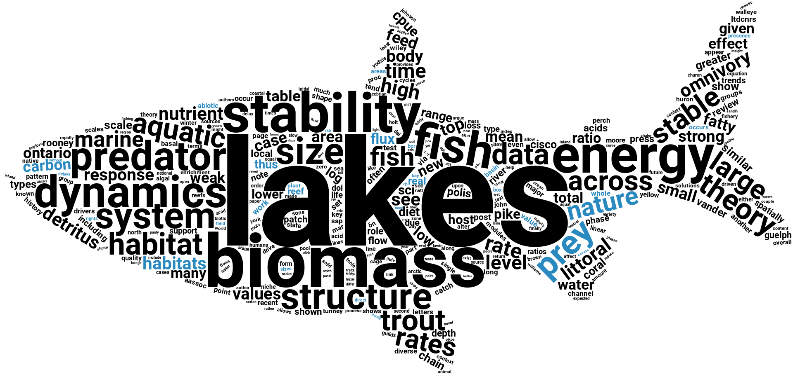
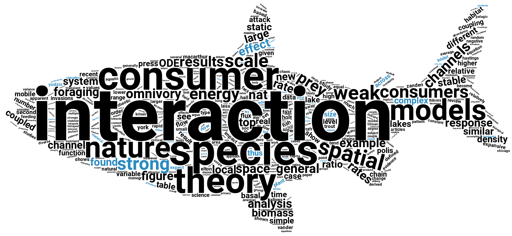
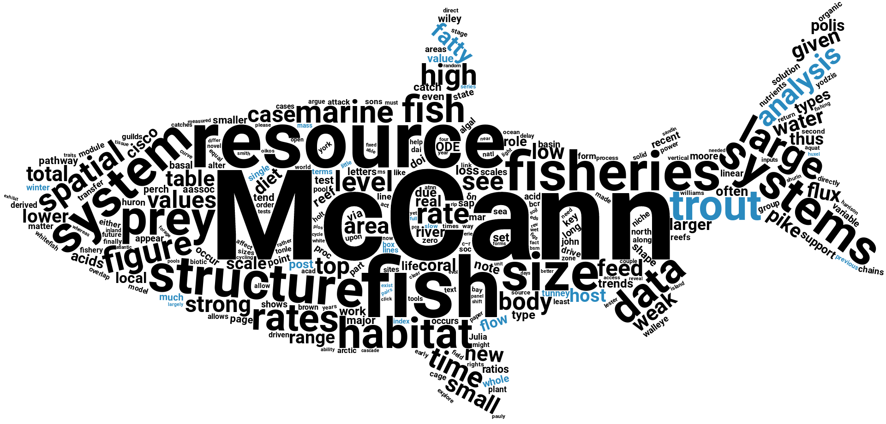
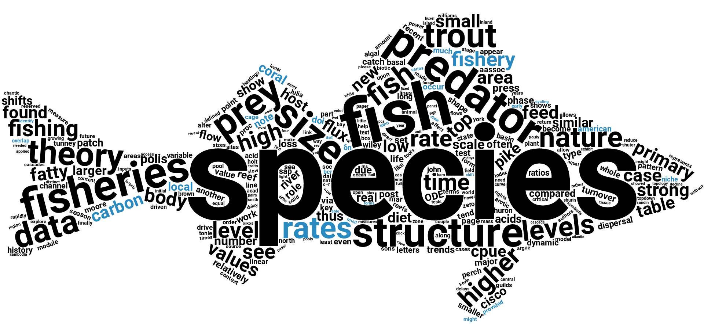
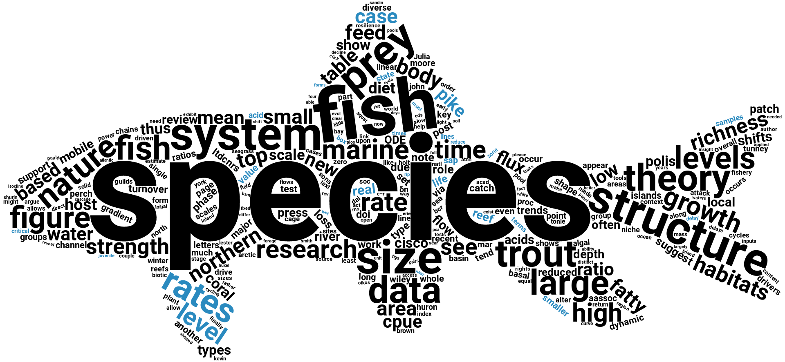
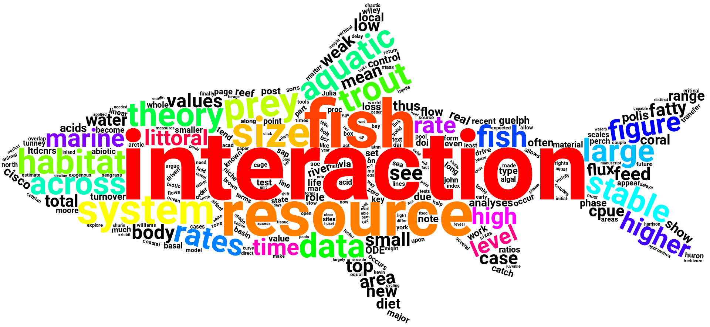

# wordCloudLab

A word cloud for the lab

## How to reproduce it?

1. Lab's papers gathered and converted to text using [pdftotext](http://www.xpdfreader.com/) (see Makefile),

2. use the [tm R package](https://cran.r-project.org/web/packages/tm/tm.pdf) to create,

3. remove a stop words and few adjustments to obtain a words/frequencies data frame stored as `corpusMcCann.rds`,

4. create the word cloud using the [wordcloud2 R package](https://cran.r-project.org/web/packages/wordcloud2/wordcloud2.pdf) and
the [*Coregonus hoyi* silouhette image available on PHYLOPIC](http://phylopic.org/name/abd8b928-8ae8-437a-9988-17ec358043b7).

## Results

